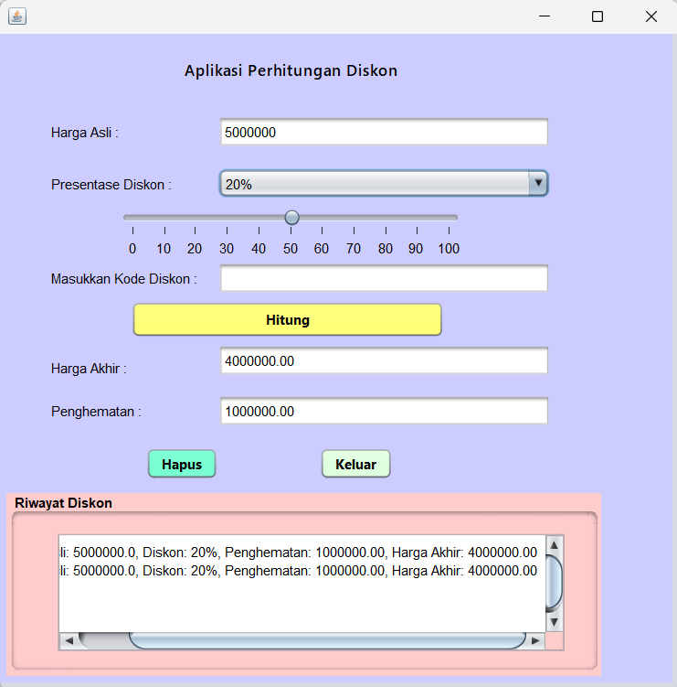

# AplikasiPerhitunganDiskon
 Tugas3_NovitaFitriaRatnawati_2210010228
 
# Aplikasi Perhitungan Diskon
Aplikasi Perhitungan Diskon adalah aplikasi untuk menghitung diskon dari sebuah harga

# Keunggulan Aplikasi
- Perhitungan Diskon: Aplikasi ini terdapat Jslider untuk memilih diskon dan terdapat kode kupon untuk menambah jumlah diskon

# Pembuat Aplikasi
 Novita Fitria Ratnawati - 2210010228 - Tugas 3

# Fitur
Aplikasi ini menawarkan fitur:

Perhitungan diskon dari sebuah harga

## Cara Menjalankan

1. Run File
2. Ketikkan Harga Yang Kita Input
3. Pilih persentase diskon bisa melalui combo box atau jslider, maka akan keluar hasil diskom
4. Masukkan kode diskon
5. Tekan Button Hitung, maka akan keluar hasil diskon ditambah kode diskon
6. Tekan Button Hapus, Jika ingin mengulang
4. Tekan Button Keluar, jika ingin keluar 

# Demo
